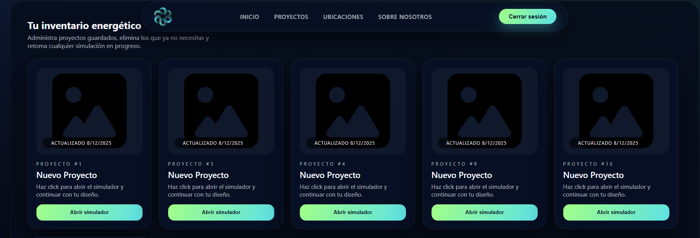
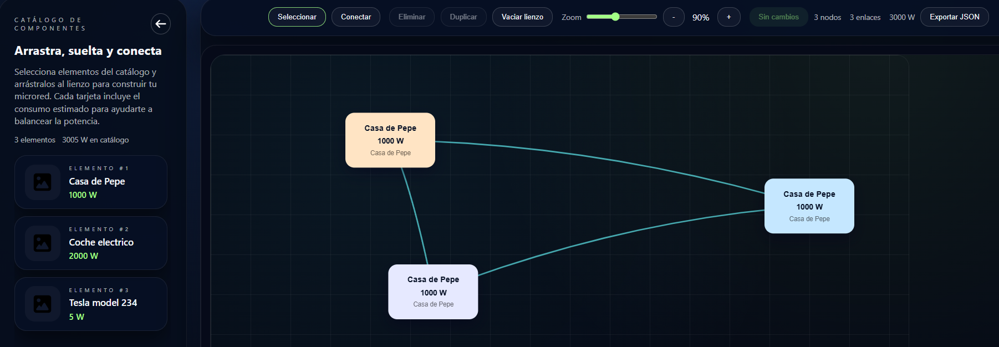
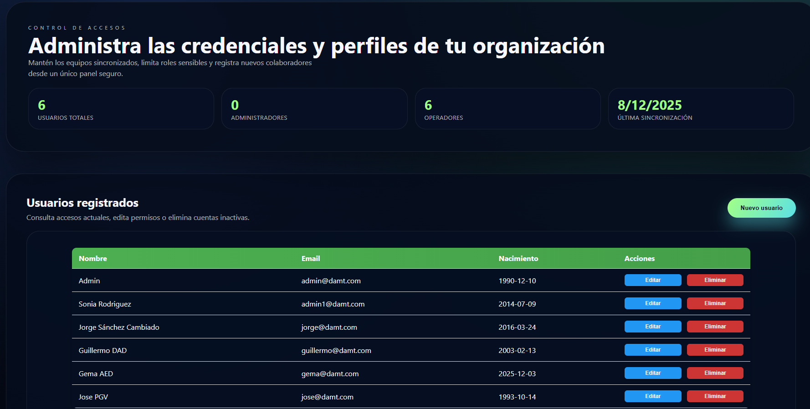
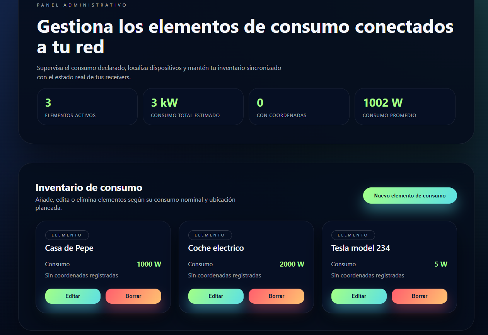

# Simulador de energías renovables

[](https://java.com)
[](https://spring.io)
[](https://reactjs.org)
[](https://android.com)

## 📌 Tabla de Contenidos
- [Introducción](#introducción)
- [Arquitectura](#arquitectura-general)
- [Deployment](#deployment)
- [Instalación](#instalación-rápida-del-proyecto)
- [Backend](#backend)
- [Web](#web)
- [Android](#android)
- [Autores](#autoría)
- [Licencia](#licencia)

## 📸 Capturas del Sistema

### 🌐 Plataforma Web
| Funcionalidad | Captura | Descripción |
|---------------|---------|-------------|
| **Gestión de Proyectos** |  | Interfaz principal para crear, editar y eliminar proyectos de energía |
| **Simulador Energético** |  | Herramienta de simulación con arrastrar/soltar elementos |
| **Panel de Administración - Usuarios** |  | Gestión de usuarios |
| **Panel de Administración - Elementos** |  | Catálogo de elementos consumidores para el simulador |

**Este documento es un documento introductorio a la parte tecnica del proyecto, si su prioridad es aprender como usar el proyecto final consulte el manual de usuario en:**<br>
[Manual de Usuario (Web)](https://docs.google.com/document/d/12xeus-JGfbwC0Ine3CZPigrr-ipz_3QHTLpGWaRd5t4/edit?usp=drive_link)<br>
[Manual de Usuario (Android)](https://docs.google.com/document/d/1SdTfeUq5j6bhIeMLVS9A8FnPbdgZmPRywt4s4j0Jkxc/edit?usp=drive_link)

Para la descarga del APK de la versión Android, puede dirigirse a la parte
derecha del repositorio GitHub y entrar en el apartado de **Releases** o abrir directamente este [enlace](https://github.com/YarCrasy/RenewableEnergyProject/releases/tag/0.0.1-snapshoot) y descargar el apk como se muestra en la imagen.


Este proyecto es Plataforma integral para simular y gestionar soluciones de energía renovable. El monorepo contiene tres superficies principales: un backend en Spring Boot, una SPA web construida con React/Vite y una app Android nativa que consume las mismas APIs. Realizado como parte del proyecto intermodular en el IES El Rincón en el plan de estudio Desarrollo de Aplicaciones Multiplataforma.

### Arquitectura general
- **Backend API (Java/Spring Boot)** expone endpoints REST `/api/*` para usuarios, proyectos y elementos del simulador.
- **Web App (Vite + React)** ofrece la UI principal de simulación, panel de proyectos y administración básica.
- **Android App (Java)** replica el flujo de autenticación y consigue proyectos mediante las mismas APIs para uso móvil.

---

## Deployment
- Backend y frontend web están desplegados en una **Raspberry Pi 5** detrás del dominio principal `https://dam-project.yarcrasy.com`.
- El backend atiende bajo `https://dam-project.yarcrasy.com/api` y comparte la misma instancia de base de datos utilizada en local.
- La SPA web se sirve desde el mismo host y consume la API pública anterior; cualquier cambio en producción debe considerar la capacidad limitada del hardware embebido.
- Para más detalle de como se hace el deployment, consulte el documento **Manual de Desarrollador (ACCESO A DATOS)** compartido

---

## Instalación Rápida del proyecto

### 1. Clonar repositorio
```bash
git clone https://github.com/YarCrasy/RenewableEnergyProject.git
cd RenewableEnergyProject
```
## Backend
**Tecnologías:** Java 21, Spring Boot, Spring Data JPA, Gradle, MySQL.

### Requisitos previos
- JDK 21+
- Gradle Wrapper incluido (`backend-api/gradlew`).
- Archivo `backend-api/src/main/resources/application.properties` configurado con la URL de base de datos y credenciales.

### Puesta en marcha (Local)
```bash
cd backend-api
./gradlew bootRun
```
El backend corre en `http://localhost:8080` y permite CORS desde cualquier origen por defecto.

### Endpoints destacados
- `POST /api/users/login` autenticación básica por email/password.
- `GET /api/projects/user/{userId}` lista proyectos del usuario.
- `POST /api/projects` crea un proyecto y enlaza automáticamente sus elementos.

Para ejecutar pruebas:
```bash
./gradlew test
```

---

## Web
**Tecnologías:** Node 18+, Vite, React, React Router DOM, CSS Modules, Axios para peticiones HTTP,  React Leaftles para mapa interactivo.

### Requisitos previos
- Node.js 18+, vite y npm 9+.
- Variables opcionales en `.env` (por ejemplo `VITE_API_BASE_URL`). Si no existe se usa la URL definida en `src/api/api.js`.

### Instalación y ejecución (Local)
```bash
cd Web
npm install
npm run dev
```
El servidor Vite se expone en `http://localhost:5173`.

### Scripts útiles
- `npm run build` genera la versión de producción.
- `npm run lint` (si se habilita en `package.json`) valida el estilo.
- `npm run test` ejecuta todos los tests con Vitest.
- `npm run test:watch` ejecuta tests en modo watch.
- `npm run test:coverage` ejecuta tests y genera cobertura.

### Testing
#### Requisitos / Setup
- Node LTS recomendado (Node 18+).
- Instalar dependencias en `Web/` con `npm install`.

#### Comandos completos
- `npm run test`
- `npm run test:watch`
- `npm run test:coverage`
- Ejecutar archivo específico: `npx vitest run src/tests/Logics/WorkspaceUtils/buildNodeSignature.test.js`
- Ejecutar por patrón o nombre: `npx vitest -t "updateProject"`

#### Cobertura (detalle)
- Se revisan métricas de `lines`, `branches`, `functions` y `statements`.
- El reporte se genera en `Web/coverage/` (`Web/coverage/index.html`).
- Regla de equipo: no aceptar PR si baja cobertura en módulos críticos (`WorkspaceUtils`, `api/projects`, `ProjectCard`, `PrivateRoute`).

#### Qué se está testeando
- Lógica: utilidades de `WorkspaceUtils` (normalización, payload, firmas, hidratación).
- Datos/API: servicios en `src/api` con mocks de cliente HTTP.
- Interfaz: flujos de `ProjectCard`, `PrivateRoute` y `FormReceiver`.

#### Guía para escribir tests (AAA)
Plantilla mínima:
```js
it('caso', async () => {
  // Arrange
  // Act
  // Assert
});
```
Ejemplo real del proyecto:
```js
it('updateProject lanza error si falta id', async () => {
  await expect(updateProject()).rejects.toThrow('updateProject requiere un id');
});
```

#### Mocks y aislamiento
- Mock de API con `vi.mock('@api/api', () => ({ ... }))` o `vi.spyOn(...)`.
- Limpieza de estado con `afterEach(() => vi.restoreAllMocks())`.

#### Troubleshooting
- `Failed to resolve import "@/..."`: revisar alias en `Web/vite.config.js` y ruta exacta (mayúsculas/minúsculas).
- `esbuild build() is unavailable in this environment`: ejecutar tests fuera del sandbox.
- `ReferenceError: fetch is not defined`: en este proyecto se mockea `@api/api` (axios), no `fetch`.
- Error de entorno DOM: confirmar `environment: 'jsdom'` y `setupFiles` en `Web/vite.config.js`.

### Funcionalidades clave
- Página de proyectos con menú contextual para abrir o eliminar proyectos.
- Simulador con menú lateral colapsable y botón flotante siempre visible.
- Indicadores guiados cuando no existen proyectos, para orientar a usuarios nuevos.

---

## Android
**Tecnologías:** Android SDK 24+, Java, Retrofit propio via `HttpURLConnection` (ver `ApiConnection`).

### Requisitos previos
- Android Studio Giraffe o superior.
- JDK 21 y Gradle wrapper del proyecto (`Android/gradlew`).
- Dispositivo físico o emulador con Android 7.0+.

### Configuración
1. Abre `Android/` con Android Studio.
2. Verifica la constante `ApiConnection.BASE_URL` y ajústala si el backend corre localmente (usar un túnel o IP accesible desde el emulador).
3. Sincroniza Gradle y genera los recursos.

### Ejecución
- Desde Android Studio: **Run > Run 'app'**.
- Desde CLI:
	```bash
	cd Android
	./gradlew assembleDebug
	```

### Flujo principal
- **MainActivity** autentica al usuario (`UsersAPI.login`).
- **ProjectsActivity** obtiene proyectos vía `ProjectsAPI.getProjectsFromUser` y permite crear nuevos registros.
- **SimulatorActivity** inicia el proceso de simulación del proyecto seleccionado con los datos obtenidos o creados.
- **ProfileActivity** accesible desde ProjectsActivity, utilizado para modificar datos del usuario

---

## Autoría 
| Autor | GitHub |
|-------|--------|
| **Lingcheng Jiang** | [@YarCrasy](https://github.com/YarCrasy) |
| **Nataly Alexandra Ipiales Barrigas** | [@natalyipiales](https://github.com/IpialesNatt) |

**Institución:** IES El Rincón  
**Curso:** 2º DAM - Desarrollo de Aplicaciones Multiplataforma  
**Año Académico:** 2025-2026  
**Módulo:** Proyecto Interdisciplinar

---

## Licencia
Pendiente de definir.

---
